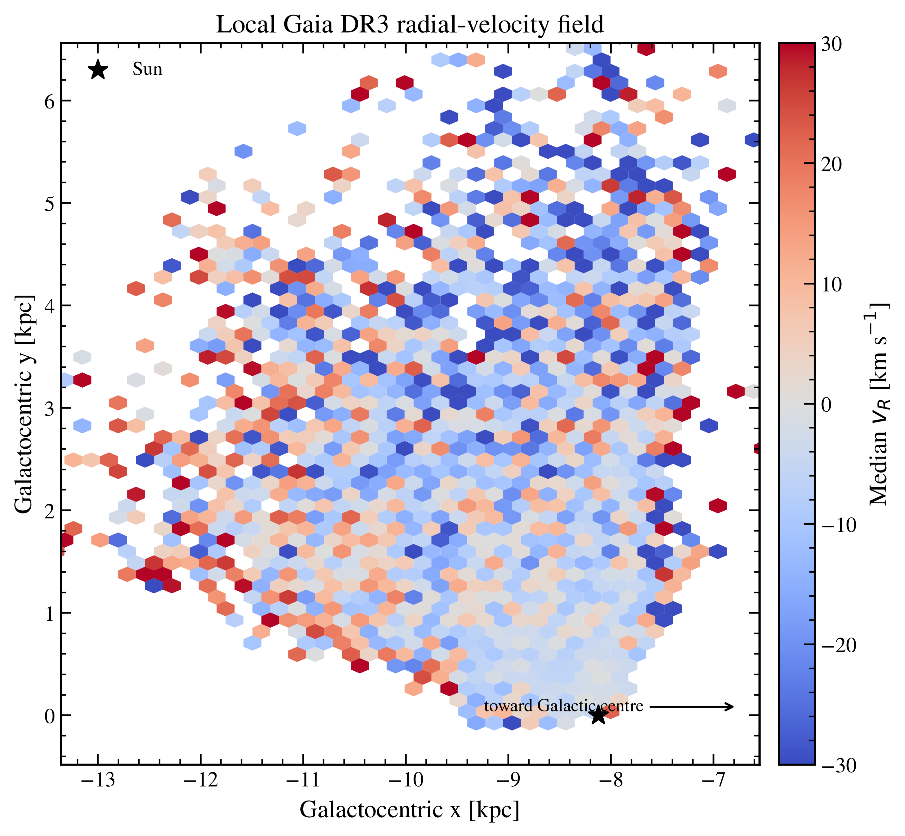
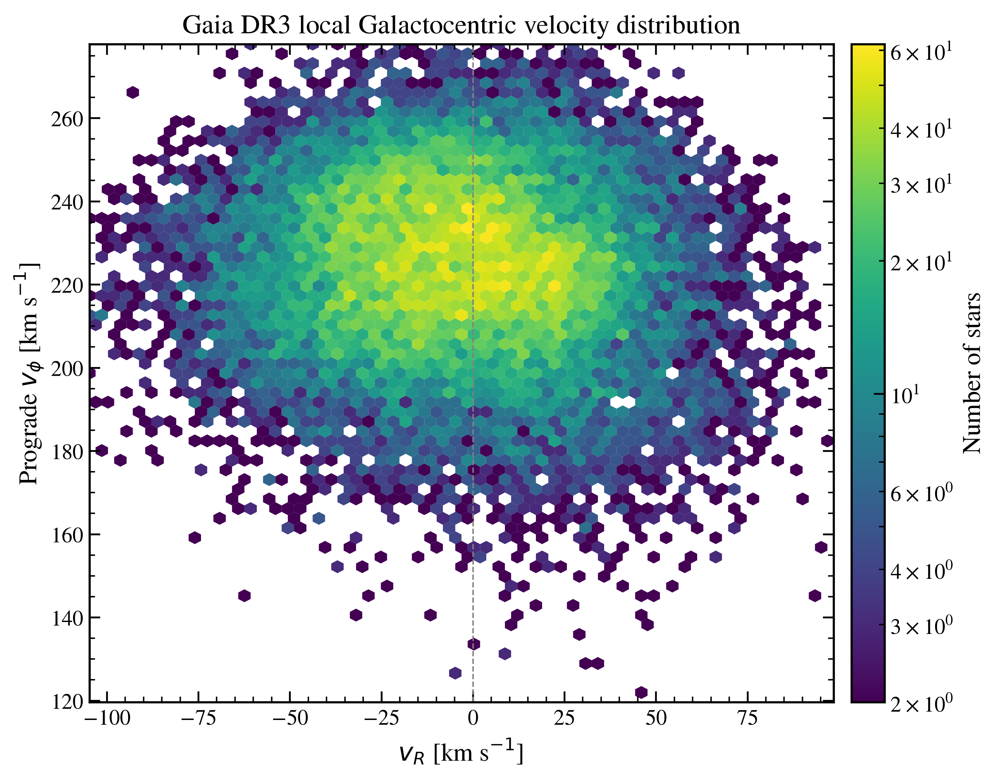
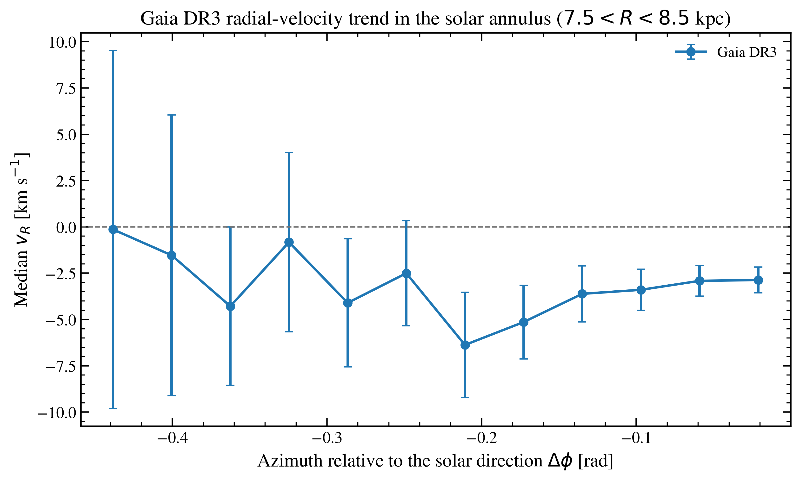
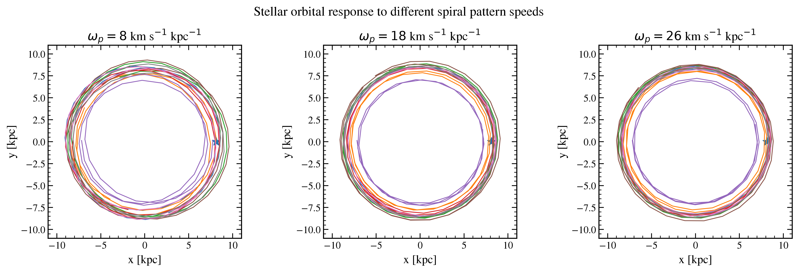
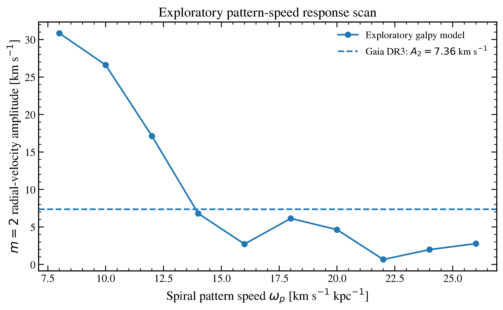

# Gaia DR3 Kinematics and Milky Way Spiral-Arm Dynamics

An independent computational Galactic-dynamics project combining **Gaia DR3 stellar kinematics** with **test-particle orbit integrations in `galpy`** to explore how the local stellar velocity field responds to a rotating spiral perturbation.

> **Status:** ongoing exploratory research project.  
> The present analysis is a deliberately simplified test-particle experiment and **is not a precision measurement of the Milky Way spiral pattern speed**.

---

## 1. Scientific motivation

The origin and dynamical nature of the Milky Way's spiral structure remain open questions. A central issue is whether the spiral arms behave approximately as long-lived density patterns rotating with a well-defined pattern speed, or whether they are transient, recurrent structures whose morphology and rotation vary with radius and time.

These scenarios make different predictions for stellar motions. Spiral perturbations can drive coherent non-circular streaming motions in the Galactic disc, particularly in the radial velocity field. Gaia therefore provides an unusually powerful way of testing spiral-structure models: rather than relying only on where spiral-arm tracers are located, we can examine how the stellar phase-space distribution responds to non-axisymmetric structure.

This project was developed as an independent exercise in Galactic dynamics, numerical orbit integration and astronomical data analysis. Its immediate question is:

> **How does the radial-velocity response of stars near the Solar radius change when the assumed spiral-arm pattern speed is varied?**

The project combines:

1. a quality-controlled sample of real **Gaia DR3** stars with measured radial velocities;
2. transformation of their astrometry into a Galactocentric phase-space representation;
3. a simple Milky-Way-like gravitational potential with a rotating two-armed logarithmic spiral perturbation;
4. test-particle orbit integrations for a grid of assumed spiral pattern speeds; and
5. a common two-fold radial-velocity statistic used to compare the simulated response with the Gaia sample.

The goal is not to determine a final Milky Way parameter from one diagnostic, but to build and test the components of a simulation-to-data Galactic-dynamics pipeline.

---

## 2. Project overview

The analysis follows the workflow

```text
Gaia DR3
   |
   v
quality selection
   |
   v
ICRS astrometry + line-of-sight velocities
   |
   v
Galactocentric positions and velocities
   |
   +-----------------------------+
   |                             |
   v                             v
observed local             galpy test-particle
velocity field             spiral simulations
   |                             |
   v                             v
two-fold radial-velocity response
   |                             |
   +-------------+---------------+
                 |
                 v
       exploratory comparison
```

The current implementation is contained in `gal-sim-fixed.py`.

---

## 3. Gaia DR3 data

### 3.1 Catalogue selection

The script queries `gaiadr3.gaia_source` through `astroquery.gaia` and requests a representative subset of stars with measured radial velocities.

The main quality cuts are:

- positive parallax larger than 0.15 mas;
- parallax signal-to-noise greater than 5;
- a measured Gaia radial velocity;
- radial-velocity uncertainty below 5 km/s;
- `ruwe < 1.4`;
- at least 10 visibility periods; and
- `phot_g_mean_mag < 16.5`.

The requested sample size is 30,000 stars. The downloaded catalogue is cached locally so that the Gaia archive does not need to be queried every time the program is run.

Because the project is intended as a compact exploratory analysis, heliocentric distance is estimated using inverse parallax. This is adequate for demonstrating the pipeline for reasonably well-measured nearby stars, but it is not a substitute for a full probabilistic distance treatment.

### 3.2 Galactocentric transformation

The Gaia observables

- right ascension and declination,
- parallax,
- proper motions, and
- line-of-sight radial velocity

are converted with `astropy.coordinates` into a Galactocentric frame.

The adopted reference values in the current script are:

- Sun-Galactic-centre distance: **8.122 kpc**;
- Solar height above the mid-plane: **0.0208 kpc**;
- Solar Galactocentric velocity: **(12.9, 245.6, 7.78) km/s**.

The transformed catalogue contains Cartesian positions and velocities together with cylindrical quantities such as Galactocentric radius, azimuth, radial velocity and prograde azimuthal velocity.

The analysis then concentrates on the local disc, especially a **Solar annulus between 7.5 and 8.5 kpc in Galactocentric radius**.

---

## 4. Observed Gaia kinematics

### 4.1 Local radial-velocity field



The first diagnostic maps the median Galactocentric radial velocity of the quality-controlled Gaia stars across the local volume sampled by the catalogue.

The figure should be interpreted as a **local kinematic map**, not as a map of the entire Galactic disc. The radial-velocity requirement and the quality cuts make the usable sample strongly concentrated around the Solar neighbourhood.

The map shows that the local field is not perfectly axisymmetric: neighbouring regions contain systematically different median radial motions. Such coherent streaming is one of the observables that can carry information about non-axisymmetric perturbations such as spiral arms and the Galactic bar.

No attempt is made here to assign every feature in this map uniquely to spiral structure.

### 4.2 Local velocity distribution



The second diagnostic shows the local distribution in radial and prograde rotational velocity for stars close to the Galactic plane.

The dominant population is centred close to the expected disc rotation speed and has a broad radial-velocity distribution around zero. The structure and width of this distribution provide a sanity check that the astrometric transformation is producing a physically plausible disc population.

The plot is descriptive rather than a fit to a distribution-function model.

### 4.3 Radial velocity with azimuth



For stars in the range **7.5 < R < 8.5 kpc**, the project bins the median radial velocity as a function of azimuth relative to the Solar direction.

The local Gaia sample covers only a limited azimuthal wedge. Re-centring the angle on the Solar direction avoids an artificial discontinuity at the usual `-pi / +pi` branch cut.

The resulting profile shows a coherent variation in median radial velocity across the observed local volume rather than a constant zero-velocity field. In the present sample, the median becomes increasingly negative over part of the observed azimuthal range before becoming less negative again.

The error bars shown in the current figure are approximate errors on the binned median. They should not be interpreted as a complete propagation of Gaia astrometric, distance and selection-function uncertainties.

---

## 5. Galactic potential and spiral model

### 5.1 Axisymmetric background

The simulations use `galpy`'s `MWPotential2014` as the axisymmetric Milky Way background potential.

The current physical scaling is approximately:

- reference Galactocentric radius: **8.122 kpc**;
- reference circular velocity: **220 km/s**.

### 5.2 Spiral perturbation

A `SteadyLogSpiralPotential` is added to the axisymmetric background.

The current spiral is intentionally simple:

- **two spiral arms**;
- pitch angle: **10 degrees**;
- perturbation parameter: **-0.02**;
- phase relative to the Sun-Galactic-centre line: **45 degrees**;
- pattern speeds scanned from **8 to 26 km/s/kpc** in steps of 2 km/s/kpc.

Only the pattern speed is varied in the current experiment. Pitch angle, perturbation strength, phase and the axisymmetric background are held fixed.

This is crucial when interpreting the result: a good match in pattern speed does **not** mean that the same pattern speed would remain preferred after the other spiral parameters, the bar, the stellar distribution function, observational errors and selection effects were allowed to vary.

---

## 6. Test-particle simulations

A cold mock disc of **400 test particles** is generated with initial radii between 7 and 9 kpc and random azimuths.

The stars initially have:

- zero radial velocity; and
- the circular velocity of `MWPotential2014` at their starting radius.

The same set of initial conditions is used for every tested pattern speed. This is important because it isolates the effect of changing the spiral rotation rate rather than mixing that effect with different random realisations of the stellar sample.

Each system is integrated for **0.5 Gyr** with the C implementation of the leapfrog integrator in `galpy`.

### Representative trajectories



The figure shows the trajectories of the same representative particles for three pattern speeds: 8, 18 and 26 km/s/kpc.

The orbits remain broadly close to circular because the imposed spiral perturbation is modest. The differences between panels are therefore subtler than the differences in the velocity-response statistic discussed below. This figure is primarily a qualitative illustration of the integrations rather than the main quantitative result.

---

## 7. Comparing the simulations with Gaia

### 7.1 Why use a two-fold radial-velocity response?

A two-armed spiral perturbation has an azimuthal symmetry that naturally motivates measuring the corresponding two-fold component of the radial-velocity field.

For both Gaia and the simulated stars, the code selects stars in the Solar annulus and in a comparable azimuthal wedge. It then measures the amplitude of the two-fold Fourier component of radial velocity.

In plain language, this asks:

> **How strongly does the radial-velocity field vary in a pattern with two maxima/minima around the Galactic disc?**

The statistic is useful because it reduces a complex velocity field to a single comparable number. However, it also discards a great deal of information: phase, radial dependence, detailed morphology and the full velocity distribution are not yet used in the model comparison.

### 7.2 Exploratory pattern-speed scan



For the current Gaia sample, the measured two-fold radial-velocity amplitude is approximately:

**7.36 km/s**

The simulated response changes strongly with the assumed spiral pattern speed.

In the current run:

- low pattern speeds around 8-12 km/s/kpc produce a much stronger radial response than observed;
- the response falls rapidly as the pattern speed is increased;
- the model sampled at **14 km/s/kpc** gives the closest amplitude to the Gaia value;
- the response is not perfectly monotonic, with a secondary increase around 18 km/s/kpc; and
- the higher pattern-speed models generally produce a weaker response in this particular fixed-parameter experiment.

The nearest sampled model therefore lies at approximately **14 km/s/kpc**.

This should be read as:

> *With the current fixed pitch angle, spiral strength, phase, background potential, initial conditions and comparison statistic, the model evaluated at 14 km/s/kpc produces the radial-response amplitude closest to that measured from the selected Gaia sample.*

It should **not** be read as:

> *The Milky Way spiral pattern speed has been measured to be 14 km/s/kpc.*

That distinction is central to this project.

---

## 8. Comparison with the literature

There is no single universally accepted Milky Way spiral pattern speed. Published estimates depend strongly on the adopted spiral model, tracer population and methodology, and some studies question whether a single rigid pattern speed is an appropriate description at all.

### Studies broadly consistent with a lower pattern speed

**Vallée (2021)** inferred a density-wave pattern speed of roughly **12-17 km/s/kpc** from spatial offsets between different spiral-arm tracers. The approximate 14 km/s/kpc response match in this project falls inside that range.

**Khalil et al. (2024, preprint)** used Gaia DR3 in-plane stellar motions to fit a global non-axisymmetric Galactic potential. Their fiducial solution contains a two-armed spiral mode with a pattern speed of **13.1 km/s/kpc** and a three-armed mode at **16.4 km/s/kpc**. The two-armed value is numerically close to the minimum-discrepancy model in the present experiment.

**Tang et al. (2026, preprint)** modelled spiral-arm streaming motions using APOGEE DR17 and Gaia DR3 and found that the observed kinematics constrain the spiral pattern speed to approximately **10-20 km/s/kpc**, while also showing that resonance structure strongly affects the radial-velocity response. The pattern-speed range explored here deliberately overlaps this regime.

The numerical agreement is encouraging as a sanity check, but it should not be interpreted as an independent confirmation of those results because the present model is substantially simpler.

### Higher pattern-speed estimates

Other methods favour appreciably higher values.

**Dias et al. (2019)** used young open clusters from Gaia DR2 and inferred a common spiral pattern speed of **28.2 +/- 2.1 km/s/kpc** for the Sagittarius-Carina, Local and Perseus arms.

**Bobylev & Bajkova (2023)** used young open clusters based on Gaia DR3 data and obtained values around **23-24 km/s/kpc** from two kinematic methods, with another birth-angle method giving approximately **29 km/s/kpc**.

These results illustrate why the 14 km/s/kpc point from the present experiment cannot be treated as a definitive determination.

### Is a single pattern speed appropriate?

An even more important issue is whether the Milky Way should be described by one rigidly rotating spiral pattern at all.

**Castro-Ginard et al. (2021)** used Gaia EDR3 open clusters and found that the explored spiral arms nearly co-rotate with field stars at their respective radii, arguing against a single common pattern speed.

**Hunt et al. (2018)** showed that winding transient spiral structure in test-particle models can naturally generate several features seen in Gaia DR2 velocity space. This provides an alternative interpretation in which the spiral pattern evolves rather than behaving as a single long-lived rigid wave.

More recent Gaia DR3 work has also emphasised the interaction between bar and spiral structure. **Vislosky et al. (2024)** found that the morphology and radial-velocity field of Milky-Way-like simulations can vary strongly with time and that bar/spiral properties can be degenerate when matching Gaia DR3.

Taken together, the literature comparison is therefore more interesting than simply asking whether `14 km/s/kpc` agrees with one published number. The broader conclusion is that **the inferred spiral dynamics depend on the physical model and on which parts of the stellar phase-space distribution are used**.

That is also the main motivation for extending this exploratory project beyond a one-dimensional pattern-speed scan.

---

## 9. Interpretation of the current result

The main result of this project is not the number 14 km/s/kpc by itself.

The more useful result is that, **even in a deliberately simple model**, changing only the rotation rate of the imposed spiral pattern produces a large and structured change in the local stellar radial-velocity response.

This demonstrates three points:

1. **Local stellar kinematics contain information about non-axisymmetric Galactic structure.**
2. **The response is sensitive to dynamical parameters such as pattern speed.**
3. **One observable is not sufficient to determine those parameters uniquely.**

For example, changing the spiral amplitude could raise or lower the radial-velocity response, while changing the pitch angle or phase could alter both its amplitude and spatial pattern. The Galactic bar can introduce additional non-axisymmetric streaming and resonances. A warmer and more realistic stellar population will also respond differently from the cold test-particle disc used here.

The present exercise is therefore best regarded as a first step toward a higher-dimensional simulation-to-data inference problem.

---

## 10. Limitations

The current model contains several deliberate simplifications.

### Gaia-side limitations

- The catalogue is a selected subset of Gaia DR3 rather than a complete forward-modelled survey sample.
- Inverse parallax is used as a simple distance estimator.
- The Gaia selection function is not explicitly modelled.
- Astrometric and radial-velocity covariance is not propagated through the full analysis.
- The observed local wedge has incomplete spatial coverage.
- The two-fold amplitude compresses the velocity field into a single scalar and ignores much of the available information.

### Simulation-side limitations

- The stellar disc is represented by only 400 non-self-gravitating test particles.
- The initial disc is kinematically cold.
- Only a narrow radial region is initially populated.
- The spiral perturbation has a fixed two-arm logarithmic form.
- Spiral strength, pitch angle and phase are fixed.
- The Galactic bar is not yet included.
- The spiral is treated as steady rather than transient or winding.
- There is no self-consistent response of the gravitational potential to the stellar distribution.
- Only a single finite integration time is considered.
- No observational selection or measurement process is applied to the simulated catalogue before comparison.

For these reasons, the pattern-speed scan is explicitly labelled **exploratory** throughout the code and figures.

---

## 11. Planned extensions

The natural next step is to replace the one-dimensional pattern-speed scan with a multi-parameter simulation grid.

Planned extensions include:

- varying **spiral pattern speed, pitch angle and perturbation strength simultaneously**;
- varying the spiral phase;
- adding a Galactic bar and varying its strength and pattern speed;
- replacing the cold mock disc with a warmer, more realistic phase-space distribution;
- increasing the number of simulated particles;
- comparing spatially resolved radial-velocity maps rather than only a single two-fold amplitude;
- forward-modelling observational uncertainties and Gaia selection effects;
- studying parameter degeneracies;
- constructing a likelihood-free or simulation-based inference pipeline that maps simulated observables to posterior constraints on Galactic parameters.

A particularly important question is whether different combinations of pattern speed, pitch angle, spiral strength and bar parameters can produce similar local velocity signatures. Demonstrating such degeneracies would motivate the use of richer summary statistics or neural simulation-based inference.

---

## 12. Reproducing the project

### Dependencies

The analysis uses Python with:

```text
numpy
pandas
matplotlib
astropy
astroquery
galpy
```

A simple environment can be created with:

```bash
pip install numpy pandas matplotlib astropy astroquery galpy
```

### Running

Clone the repository and run:

```bash
python gal-sim-fixed.py
```

On the first run, the script queries Gaia DR3 and stores the selected catalogue locally as:

```text
gaia_dr3_local_rvs.csv
```

Subsequent runs load the cached file.

The program then:

1. transforms the Gaia catalogue to Galactocentric phase space;
2. generates the three Gaia diagnostic figures;
3. constructs the same mock stellar disc for every spiral pattern speed;
4. integrates the orbits;
5. generates the representative orbit figure; and
6. calculates and plots the exploratory pattern-speed response scan.

The Gaia TAP service can occasionally return server-side errors for large queries. If this happens, retrying later or using the cached local catalogue avoids rerunning the archive query.

---

## 13. Output files

The script produces:

```text
figure1_gaia_vR_xy.png
figure2_gaia_velocity_distribution.png
figure3_gaia_azimuthal_vR.png
figure4_simulated_orbits.png
figure5_pattern_speed_scan.png
```

Suggested repository structure:

```text
.
├── README.md
├── gal-sim-fixed.py
├── figures/
│   ├── figure1_gaia_vR_xy.png
│   ├── figure2_gaia_velocity_distribution.png
│   ├── figure3_gaia_azimuthal_vR.png
│   ├── figure4_simulated_orbits.png
│   └── figure5_pattern_speed_scan.png
└── requirements.txt
```

If the figures are moved into a `figures/` directory, update the image paths in this README accordingly.

The cached Gaia catalogue is better excluded from GitHub because it can be regenerated from the archive. For example, add:

```text
gaia_dr3_local_rvs.csv
__pycache__/
*.pyc
```

to `.gitignore`.

---

## 14. Key takeaways

- A real Gaia DR3 sample was transformed into Galactocentric positions and velocities and used to characterise the local stellar velocity field.
- A two-armed logarithmic spiral perturbation was added to a Milky-Way-like `galpy` potential.
- The same mock stellar population was evolved for pattern speeds between 8 and 26 km/s/kpc.
- The radial-velocity response is strongly dependent on the assumed pattern speed in this model.
- The Gaia sample has a two-fold radial-velocity amplitude of about **7.36 km/s**.
- Of the discrete models tested, the **14 km/s/kpc** simulation gives the closest response amplitude.
- This value is broadly compatible with several low-pattern-speed results in the literature, including recent Gaia-based dynamical work, but other methods favour substantially higher pattern speeds or reject the assumption of a single rigid pattern speed.
- The present result is therefore a **proof of concept for simulation-to-data Galactic dynamics**, not a final parameter measurement.

---

## 15. References

- **Bovy, J. (2015)**, *galpy: A Python Library for Galactic Dynamics*, ApJS, 216, 29.  
  https://doi.org/10.1088/0067-0049/216/2/29

- **Dias, W. S., Monteiro, H., Lépine, J. R. D. & Barros, D. A. (2019)**, *The spiral pattern rotation speed of the Galaxy and the corotation radius with Gaia DR2*, MNRAS, 486, 5726.  
  https://doi.org/10.1093/mnras/stz1196

- **Hunt, J. A. S., Bovy, J., Carlberg, R. G. et al. (2018)**, *Transient spiral structure and the disc velocity substructure in Gaia DR2*, MNRAS, 481, 3794.  
  https://doi.org/10.1093/mnras/sty2532

- **Vallée, J. P. (2021)**, *A low density wave's spiral pattern speed, from the tracer separations (age gradient) across a spiral arm in the Milky Way*, MNRAS, 506, 523.  
  https://doi.org/10.1093/mnras/stab1679

- **Castro-Ginard, A., McMillan, P. J., Luri, X. et al. (2021)**, *On the Milky Way spiral arms from open clusters in Gaia EDR3*.  
  https://arxiv.org/abs/2105.04590

- **Bobylev, V. V. & Bajkova, A. T. (2023)**, *Determination of the Spiral Pattern Speed in the Milky Way from Young Open Star Clusters*.  
  https://arxiv.org/abs/2309.12097

- **Vislosky, E. et al. (2024)**, *Gaia DR3 data consistent with a short bar connected to a spiral arm*, MNRAS, 528, 3576.  
  https://doi.org/10.1093/mnras/stae083

- **Khalil, Y. R., Famaey, B., Monari, G. et al. (2024)**, *A non-axisymmetric potential for the Milky Way disk*.  
  https://arxiv.org/abs/2411.12800

- **Tang, X.-C., Li, Z., Simion, I. T. et al. (2026)**, *Tracing the kinematic perturbations of the Milky Way spiral arms with APOGEE DR17 and Gaia DR3*.  
  https://arxiv.org/abs/2605.10092

- **Katz, D. et al. (2023)**, *Gaia Data Release 3: Properties and validation of the radial velocities*, A&A, 674, A5.  
  https://doi.org/10.1051/0004-6361/202244220

---

## 16. Author

**Muhammad Areeb Qureshi**

Physics and Astrophysics MPhys, University of Warwick

Research interests: Galactic dynamics, numerical simulation, astronomical data analysis and simulation-based inference.

---

### Note on interpretation

This repository documents an ongoing independent research project. Numerical values in the exploratory comparison depend on the present model assumptions and should not be quoted as a precision constraint on Milky Way spiral structure without the additional modelling described above.
